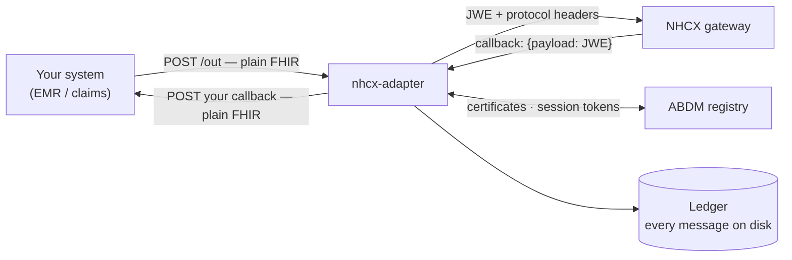
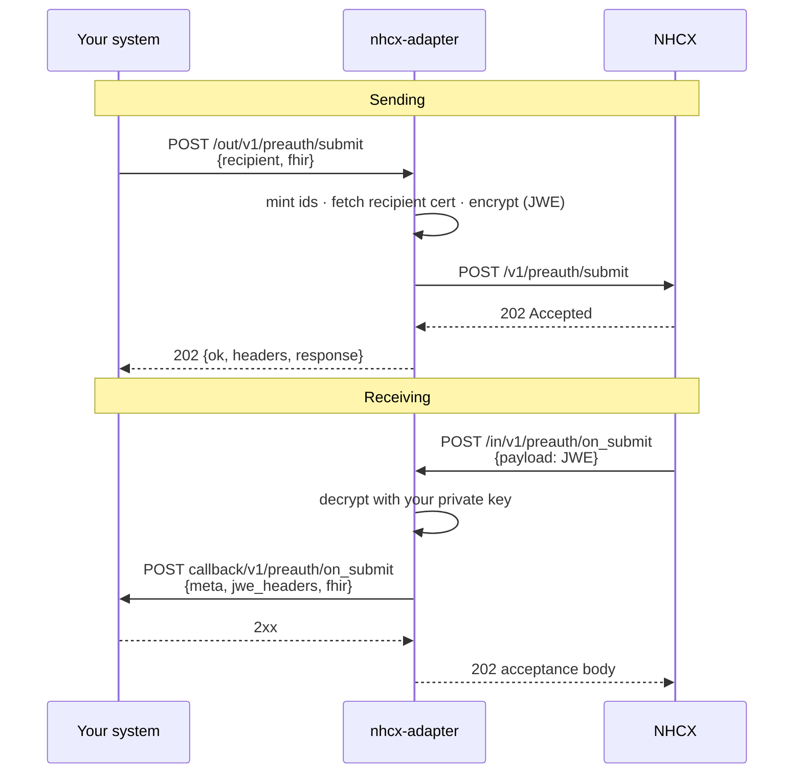
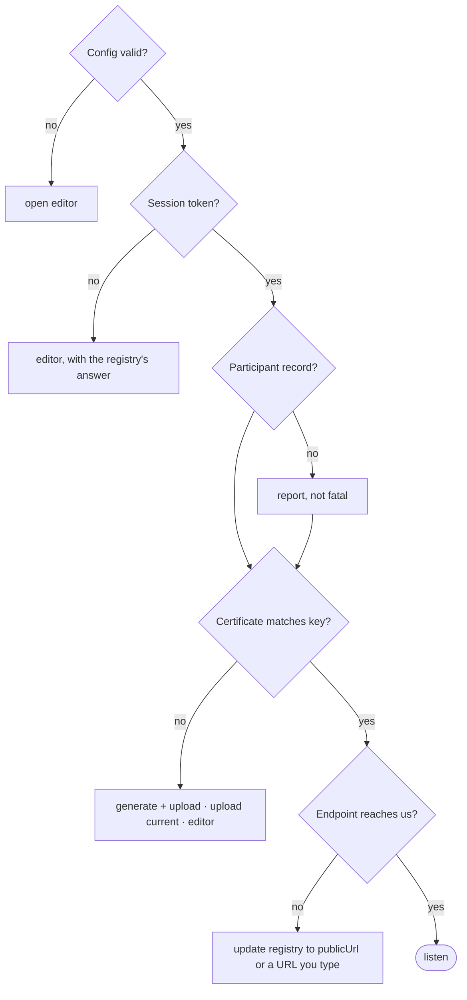

# NHCX Adapter

[](https://github.com/nha-in/nhcx-adapter/actions/workflows/ci.yml)
[](https://github.com/nha-in/nhcx-adapter/releases)
[](https://go.dev)

A stateless adapter between your system and India's National Health Claims
Exchange (NHCX). One binary, one JSON config, no database.

You POST plain FHIR. It handles the protocol headers, the encryption, the
session tokens and the registry lookups. NHCX callbacks come back to you
decrypted.



---

## Quick start

```sh
make build                                  # → ./nhcx-adapter (Go 1.26, no CGO)

export NHCX_CLIENT_ID=…  NHCX_CLIENT_SECRET=…  NHCX_ADAPTER_API_KEY=…
./nhcx-adapter config edit                  # arrow-key form; creates config.json
./nhcx-adapter serve                        # checks the setup, fixes what it can, then listens

./nhcx-adapter ledger follow                # another terminal: the traffic, live
```

`serve` verifies credentials, participant record, certificate and registered
endpoint before it listens, and in a terminal offers to fix whatever fails.
See [Startup checks](#startup-checks).

Release archives also carry `serve`, `serve-hidden`, `stop` and `update`
scripts (`.bat` on Windows, `.sh` elsewhere), so a server starts, stops and
upgrades without remembering any flags.

---

## How it works

Both directions are synchronous. There is no queue.



If your callback is down, NHCX gets an error and redelivers — five attempts,
then the correlation id is dropped. **Your callback must be idempotent on
`x-hcx-correlation_id`.**

---

## Configuration

`config.json` — create with `config init`, edit with `config edit` or by hand:

```json
{
  "env": "sandbox",
  "listen": "127.0.0.1:8090",
  "publicUrl": "https://hcx.example.com/in",
  "apiKey": "${NHCX_ADAPTER_API_KEY}",
  "participant": {
    "participantId": "1000003463@hcx",
    "clientId": "${NHCX_CLIENT_ID}",
    "clientSecret": "${NHCX_CLIENT_SECRET}",
    "privateKey": "@private_key.pem"
  },
  "callback": { "url": "http://127.0.0.1:8765/nhcx/callback" }
}
```

`${NAME}` reads an environment variable, `@file` reads a file next to the
config. Unknown keys are rejected. The keys that matter:

| Key | Default | Meaning |
| --- | --- | --- |
| `env` | `sandbox` | `sandbox` or `production` — picks gateway, registry, session endpoint and `X-CM-ID`. |
| `listen` | `127.0.0.1:8090` | HTTP listener. |
| `publicUrl` | — | How NHCX reaches this adapter; proposed as the registry `endpoint_url`. |
| `apiKey` | — | Bearer key your system sends to `/out` and `/token`. **Required in production.** |
| `participant.*` | — | Your registry code, ABDM `clientId`/`clientSecret`, and the RSA `privateKey` of your registered certificate. |
| `callback.url` | — | Where decrypted messages are POSTed. |
| `callback.apiKey` | — | Sent to your backend as `Authorization: Bearer`. |
| `panel.password` | — | Set one (8+ chars) to serve the browser console at `/panel`. Blank means no console. |
| `ledger.enabled` | `true` | Record every message that crosses the adapter. |
| `log.level` / `log.format` | `info` / `json` in production | `text` is the coloured one-line-per-message terminal format. |

Everything else has a sensible default: `callback.appendPath`, `routes`,
`timeoutSeconds`, `also` (fan out one delivery to several backends),
`ledger.dir`/`retentionDays`/`storeBodies`, `panel.path`/`sessionHours`,
`certificate.*`, `urls.*` endpoint overrides, `auth.mode`, `certs.cacheHours`,
`tls.certFile`/`keyFile`, `maxBodyBytes`, `outboundTimeoutSeconds`.
`config edit` lists all of them with their defaults, validates as you type,
and masks secrets.

### Environments

| | Sandbox | Production |
| --- | --- | --- |
| NHCX gateway | `https://apisbx.abdm.gov.in/hcx/v1` | `https://apis.abdm.gov.in/hcx/v1` |
| Participant registry | `…/pmjay/sbxhcx/participanthcxservice` | `…/pmjay/hcx/participanthcxservice` |
| Sessions | `https://dev.abdm.gov.in/api/hiecm/gateway/v3/sessions` | `https://live.abdm.gov.in/…` |
| `X-CM-ID` | `sbx` | `abdm` |

Sandbox values are verified. Production values follow NHA's documented host
swap — confirm against your onboarding letter, override under `urls` if they
differ.

### Several participants in one process

The top-level `participant` is the default; each entry in `participants` is
another identity. **A hosted entry needs only a code and a callback** —
credentials, key and unset callback fields are inherited.

```json
"participants": [
  { "participantId": "1000004805@hcx", "name": "Dummy IRDAI Payer",
    "callback": { "url": "http://127.0.0.1:8082/nhcx/callback" } }
]
```

Inbound, `x-hcx-recipient_code` picks the profile whose key decrypts and whose
callback receives. Outbound, `x-hcx-sender_code` picks who sends. Sessions are
one per distinct `clientId`. An unheld code is refused as `WRONG_RECIPIENT`.

---

## Startup checks

`serve` and `check` run these in order:

```
checking setup for 1000003463@hcx (sandbox)…
  ✓ session token            issued by https://dev.abdm.gov.in/api/hiecm/gateway/v3/sessions
  ✓ participant record       1000003463@hcx · Healthica · endpoint https://hcx.example.com/in
  ✓ encryption certificate   registry certificate matches participant.privateKey
  ✓ local listener           127.0.0.1:8090 (started for this check)
  ✓ registered endpoint      https://hcx.example.com/in/healthz reaches this adapter
```



The endpoint check POSTs a random nonce to `<endpoint_url>/healthz` and
expects an HMAC only an identically configured adapter can produce, so a proxy
answering 200 with something else is caught. The listener is started first, so
the result is about the proxy hop, never about an adapter that was not up.

Without a terminal the same checks run: config, token and certificate failures
exit non-zero, an endpoint failure is a warning. Flags: `--no-tui`,
`--skip-checks`, `--no-banner`.

---

## HTTP API

| Route | Does |
| --- | --- |
| `POST /out/<nhcx-path>` | Send. Needs the API key. |
| `POST /in/<nhcx-path>` | Receive from NHCX. Register `https://<host>/in` as your `endpoint_url`. |
| `GET /ledger`, `/ledger/{id}`, `/ledger/thread/{corr}`, `/ledger/stats` | The traffic ledger. Needs the API key. |
| `GET /token` · `POST /token/refresh` | The ABDM session token, for calls the adapter does not make. Needs the API key. |
| `GET /panel` | The operator console, behind its own password. |
| `GET /healthz` · `GET /readyz` | Liveness; readiness (503 until a token is held). Unauthenticated. |

### Sending

```sh
curl -s http://127.0.0.1:8090/out/v1/preauth/submit \
  -H "Authorization: Bearer $NHCX_ADAPTER_API_KEY" -H 'Content-Type: application/json' \
  -d '{"recipient": "1000004805@hcx", "fhir": { …Bundle… }}'
```

`recipient` is the only required field. `sender`, `correlation_id`,
`request_id`, `workflow_id` and `status` are optional — missing ids are minted
as UUIDs, `x-hcx-status` defaults to `request.initiated` (`response.complete`
on an `on_` path). A response **must** carry the request's `correlation_id`;
it is the one thing the adapter cannot infer.

The HTTP status is NHCX's own. The body reports what went on the wire:

```json
{ "ok": true, "path": "v1/preauth/submit", "gateway_status": 202,
  "headers": { "x-hcx-correlation_id": "…", "x-hcx-api_call_id": "…" },
  "response": { …NHCX body… }, "duration_ms": 412, "ledger_id": "7UMV0007" }
```

Local failures come back as `{"ok": false, "error": {"code", "message",
"retryable"}}`: `400` bad envelope · `401` API key · `422` no usable
certificate (`CERT_NOT_FOUND`, `SELF_ENCRYPTION_KEY`) · `502` ABDM unreachable
or token refused.

### Receiving

NHCX posts `{"payload": "<JWE>"}`; your callback gets:

```json
{ "meta": { "type": "in", "payloadType": "fhir", "path": "v1/preauth/on_submit" },
  "jwe_headers": { "x-hcx-sender_code": "…", "x-hcx-correlation_id": "…" },
  "fhir": { …decrypted Bundle… } }
```

with `X-Nhcx-Path`, `X-Nhcx-Correlation-Id`, `X-Nhcx-Api-Call-Id`,
`X-Nhcx-Redelivery` and, if configured, `Authorization: Bearer`. Your 2xx
becomes NHCX's 202; anything else makes NHCX retry.

---

## Ledger

Every message that crosses the adapter is recorded — headers, bundle, and what
happened to it — as one JSON file per message under
`ledger.dir/<yyyy-mm-dd>/`. No database; pruned hourly by `retentionDays`.

Each record carries `direction`, `path`/`entity`/`action`/`kind`, the protected
headers, a `status` (`accepted`/`rejected`/`failed` outbound;
`delivered`/`delivery_failed`/`rejected` inbound), the `peer`'s answer, a
`redelivery` flag, and `fhir_summary` — resource types, focus resource,
patient, outcome — so a bundle can be understood without parsing it.

```sh
nhcx-adapter ledger list --since 24h --entity preauth --status rejected
nhcx-adapter ledger follow --direction in     # live, coloured, like the server log
nhcx-adapter ledger show 7UMV0007
nhcx-adapter ledger thread 0f4c2b2e-9c7a-4d55-8a1e-2b1b0c7d9e11
nhcx-adapter ledger stats
```

`--json` on any of them for machine-readable output. `follow` reads the files
directly, so it needs nothing running and does not touch the adapter that is.

```
12:01:05.123 7UMV0007 ▲ OUT v1/preauth/submit    → 1000004805@hcx  accepted   nhcx 202      412ms
12:01:05.480 7UMV0008 ▼ IN  v1/preauth/on_submit ← 1000004805@hcx  delivered  callback 200  480ms
12:04:22.910 7UMV0009 ▼ IN  v1/claim/on_submit   ← 1000004805@hcx  delivery_failed  callback 500
```

Two behaviours come with the ledger: an outbound `on_` response with no
`correlation_id` is threaded to the newest matching inbound request, and a
redelivered callback arrives with `X-Nhcx-Redelivery: true`.

---

## Panel

A browser console served by the adapter at `/panel`, off until you give it a
password. Five tabs: **Live** (messages as they happen), **Ledger** (filter,
page, open a message and its thread), **Send** (the `/out` envelope as a
form, same code path as an integrator's send), **Lookup** (a participant's
registry record and certificate), **Setup** (tokens, ledger config, clear).

One embedded HTML file — no framework, no build step, no external asset, so it
works on a jump box with no internet.

A login mints a cookie signed with a key made at startup: nothing is written
down and a restart signs everyone out. The cookie is `HttpOnly`,
`SameSite=Strict`, `Secure` under TLS; state-changing calls need a header a
cross-site form cannot send; failed logins back off per address from one
minute to fifteen.

Behind a reverse proxy, serve it on the **same path** — the cookie is scoped to
`panel.path`, so a proxy that strips a prefix breaks the login. Turn off
buffering (the live view is server-sent events). Note that the rate limit then
counts by the proxy's address, one shared counter; trusting a forwarded header
would let an attacker reset it at will.

It can send as you and read every recorded bundle. Give it a real password, put
TLS in front of it if it is reachable from anywhere but localhost, and set
`"panel": {"enabled": false}` where there should not be one.

---

## Command line

```
nhcx-adapter serve    [--no-tui] [--skip-checks] [--no-banner]   check the setup, then listen
nhcx-adapter check    [--no-tui] [--endpoint URL]                check (and offer fixes), exit 0/1
nhcx-adapter send     --path v1/preauth/submit --recipient CODE [--file bundle.json]
nhcx-adapter cert     CODE [--refresh]                           print a counterparty's certificate
nhcx-adapter cert generate [--days N] [--force]                  create your key + certificate
nhcx-adapter token                                               print a fresh session token
nhcx-adapter decrypt  [--file jwe-or-callback.json]              decrypt a JWE with your key
nhcx-adapter config   init|edit [FILE]                           write the sample / open the editor
nhcx-adapter ledger   list|show|thread|stats|follow|clear        browse or watch the traffic
nhcx-adapter update   [--list] [--check] [--latest] [--to TAG] [-y] [--prerelease]
nhcx-adapter version
```

All commands take `--config FILE` (default `$NHCX_ADAPTER_CONFIG`, then
`./config.json`). `send` and `serve` share one code path, so a `send` that
works means `serve` will.

---

## Running and updating

Every release archive holds the binary, this README, `config.sample.json` and
four scripts that `cd` to their own directory, so they work from anywhere or a
double-click:

| Windows | Unix | Does |
| --- | --- | --- |
| `serve.bat` | `./serve.sh` | Runs in this window; Ctrl+C stops it. |
| `serve-hidden.bat` | `./serve-hidden.sh` | Background, no window. Logs to `logs/`, pid to `nhcx-adapter.pid`. Refuses a second instance; prints the log tail if the checks failed. |
| `stop.bat` | `./stop.sh` | Graceful shutdown (30 s drain), then force. |
| `update.bat` | `./update.sh` | `nhcx-adapter update`, then reminds you to restart. |

`nhcx-adapter update` reads this project's GitHub releases and installs any of
them over the running binary — newer **or older**, so a bad release is a
one-command rollback. It verifies the archive against the release's
`SHA256SUMS`, renames the new binary into place, and runs its `version` to
prove it starts. **A running server keeps its version until restarted.**

Non-interactive flags: `--latest`, `--to v1.1.0`, `--list`, `--check` (exits 1
when a newer release exists, for cron). `serve` also checks once at startup in
the background and just logs the result; `--no-update-check` turns that off.
`NHCX_ADAPTER_UPDATE_REPO`, `GITHUB_TOKEN` and `NHCX_ADAPTER_GITHUB_API` point
it at another repository.

### Deploying

- **Reverse proxy**: TLS on nginx/Caddy, forward `https://host/in` →
  `127.0.0.1:8090/in`, set `publicUrl` to match. `X-Forwarded-For` is not
  trusted; the peer address is what gets logged.
- **systemd**: `serve --no-tui`. The checks still run and a failure exits
  non-zero. Use `check --no-tui` as a health gate before cut-over.
- **Docker**: see [Docker](#docker) below.
- **Secrets**: in the environment (`${VAR}`), the key in an `@file` at mode
  0600. Bodies and tokens are never logged.
- **Shutdown**: SIGINT/SIGTERM drain in-flight requests for up to 30 s.
- **Token**: refreshed a minute before expiry, on demand when missing, and once
  more on any upstream 401.

### Docker

Images for linux/amd64, arm64, arm/v7, arm/v6, 386, ppc64le, s390x and
riscv64 are published to
`ghcr.io/nha-in/nhcx-adapter`: `:latest` and `:X.Y.Z` / `:X.Y` from release
tags, `:main` and `:sha-<commit>` from every push to main.

```sh
cp .env.example .env                                   # fill in the required four
docker compose run --rm nhcx-adapter cert generate     # first run: key + certificate into ./data
docker compose up -d
docker compose exec nhcx-adapter nhcx-adapter ledger follow
```

The image carries its own config (`config.docker.json`) that listens on
`0.0.0.0:8090` and reads everything from the environment:

| Variable | Default | Maps to |
| --- | --- | --- |
| `NHCX_PARTICIPANT_ID` | **required** | `participant.participantId` |
| `NHCX_CLIENT_ID` / `NHCX_CLIENT_SECRET` | **required** | `participant.clientId` / `clientSecret` |
| `NHCX_CALLBACK_URL` | **required** | `callback.url` |
| `NHCX_ENV` | `sandbox` | `env` |
| `NHCX_PUBLIC_URL` | — | `publicUrl` |
| `NHCX_ADAPTER_API_KEY` | — | `apiKey` (required in production) |
| `NHCX_CALLBACK_API_KEY` | — | `callback.apiKey` |
| `NHCX_PANEL_PASSWORD` | — | `panel.password` |
| `NHCX_LOG_LEVEL` / `NHCX_LOG_FORMAT` | `info` / `json` | `log.*` |

Everything stateful lives in the `/data` volume: `private_key.pem`,
`certificate.pem` and `ledger/`. An existing key goes in by copying it to
`data/private_key.pem`. The container runs as uid 10001, so on Linux the
bind-mounted `data/` must be writable by it (`sudo chown -R 10001:10001 data`,
or set `NHCX_UID`/`NHCX_GID` in `.env` to your own ids).

To use a full hand-written config instead, put it at `data/config.json`, set
`NHCX_ADAPTER_CONFIG=/data/config.json`, and give it `"listen": "0.0.0.0:8090"`.
The default `127.0.0.1` is unreachable from outside the container.

`serve` runs its setup checks before it listens. Without a terminal a failure
exits non-zero, and `restart: unless-stopped` will keep retrying, so watch
`docker compose logs` on first start. To run the checks with the interactive
fixes, use `docker compose run --rm -it nhcx-adapter serve`. To start
regardless, use `serve --no-tui --skip-checks`. The healthcheck polls
`/healthz` on 8090, and `nhcx-adapter update` does not apply here: pull a new
tag instead.

### Build & release

```sh
make build          # this machine
make check          # vet + race tests
make compile-all    # verify all 14 targets compile
make release        # package all targets into ./dist (+ SHA256SUMS)
make docker         # container image nhcx-adapter:<version>
```

Linux amd64/arm64/arm/386/ppc64le/s390x/riscv64 · macOS amd64/arm64 ·
Windows amd64/arm64/386 · FreeBSD amd64/arm64. CI runs the checks, packages
each target as its own artifact, and builds,
boots and pushes the container image on each push;
every push to main also refreshes the `edge` pre-release with fresh
binaries (which `update` never offers), and
`git tag v1.0.0 && git push origin v1.0.0` publishes them as a release. The
archive name `nhcx-adapter_<tag>_<os>_<arch>.tar.gz|.zip` and the `SHA256SUMS`
are what `update` relies on — keep both if you fork the release process.

---

## Troubleshooting

| You see | It means | Do |
| --- | --- | --- |
| `TOKEN_HTTP_400/401 … Invalid user credentials` | wrong `clientId`/`clientSecret`, or sandbox credentials against production | fix in `config edit`; check `env` |
| `TOKEN_UNREACHABLE` | session endpoint not reachable | network/proxy; or `auth.mode: get-session` if onboarding says so |
| `encryption certificate … does NOT match` | registry holds a certificate for another key | pick *generate + upload*, or upload the current key's certificate |
| `CERT_NOT_FOUND` on `/out` | the recipient has no certificate on the registry | they must register one; nothing you can do locally |
| `SELF_ENCRYPTION_KEY` | registry handed out *your* certificate for another code | `cert CODE --refresh`; contact the registry |
| `registered endpoint … without a probe acknowledgement` | the URL is answered by something other than this adapter | route the path to `listen`, then *update the registry* |
| `NHCX-1015 You are not authorized to update/modify details` | only the client id that **created** the participant may change its endpoint or certificate | use the creator's credentials, or the NHCX portal / support |
| `WRONG_RECIPIENT` on `/in` | a message for another participant reached you | check that participant's registry `endpoint_url` |
| `DECRYPT_FAILED` on `/in` | encrypted for a key you don't hold | your registered certificate is not this key — run `check` |
| callback returns 4xx/5xx | your backend rejected the delivery | NHCX retries five times; fix the backend, keep it idempotent |

Check a counterparty's certificate with `nhcx-adapter cert 1000004805@hcx`.
Inspect a captured callback with `nhcx-adapter decrypt --file body.json`.
